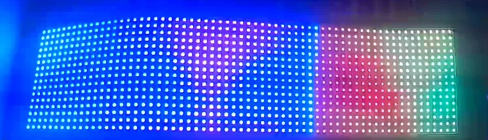
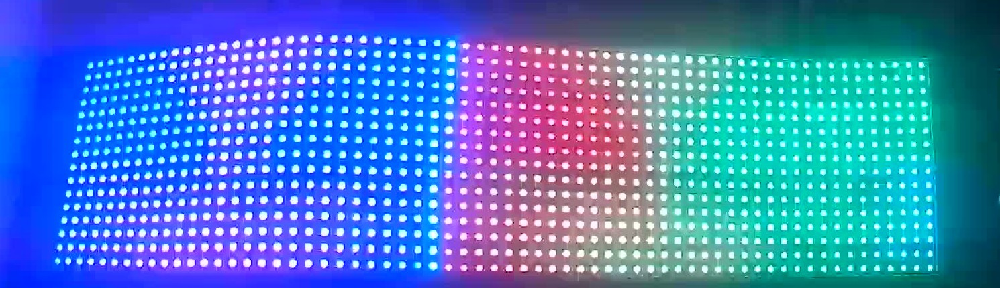
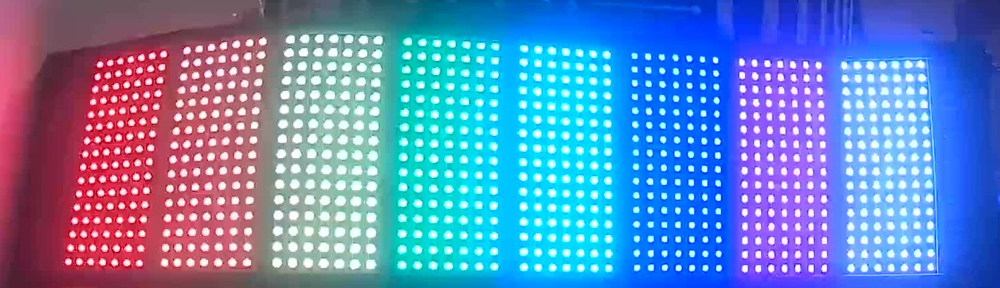
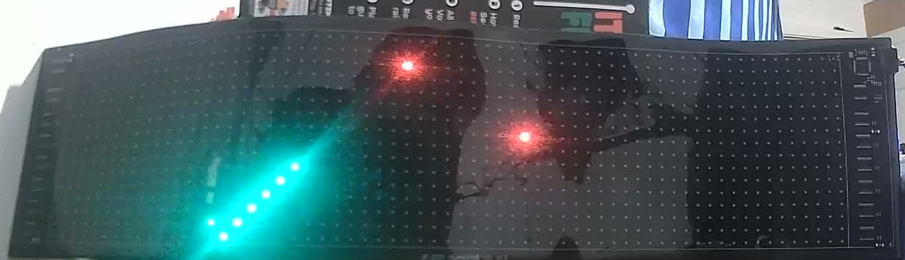
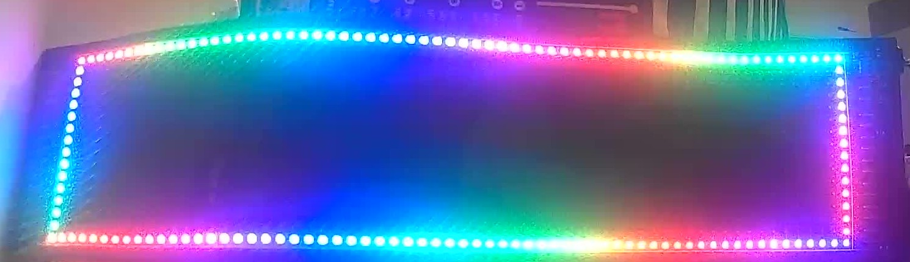
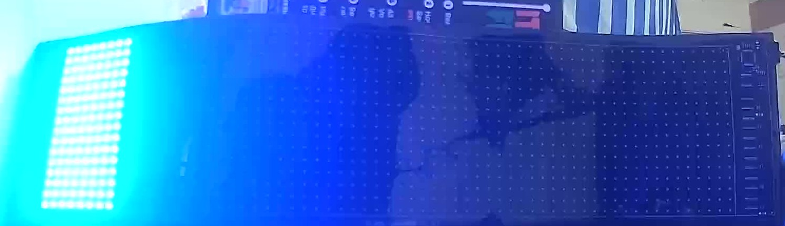

# CoolLEDUX BLE API Reference

How to talk to the sign, as an API. Every call below has a matching Python
function -- most now live in the general-purpose
[`coolledux-ble`](https://github.com/CharlesLennon/coolledux-ble) library
this project builds on, a few (the ones specific to this project's own
message content) in `bake_messages_coolledux.py` directly -- copy-paste the
example, run it, `.hex()` the result, send it.

Confidence markers on every call:
- **CONFIRMED** — sent to the real sign, response and/or visual result
  checked. Trust these.
- **SOURCE-ONLY** — byte layout read from the decompiled app, structurally
  consistent with everything confirmed so far, but never actually sent.
  Should work; hasn't been proven.
- **NOT IMPLEMENTED** — deliberately not built (OTA — risky; Flutter-only
  features — not reachable at all).

---

## 0. Quick start

```python
import bake_messages_coolledux as bmc

# Simplest possible thing: turn the sign on and set it red.
power_on   = bmc.power_command_bytes(True)
solid_red  = bmc.light_color_bytes("#FF0000")

# Every *_bytes()/*_command_bytes() function returns a ready-to-write
# envelope. Over BLE: write it to characteristic 0000fff1 (service 0000fff0),
# write-without-response. Over this project's serial test harness:
print("RAWHEX:" + power_on.hex())
print("RAWHEX:" + solid_red.hex())
```

Reading a response back (device info, password check, timer/countdown/
stopwatch queries all reply over BLE notify on the same characteristic):

```python
raw_notify_bytes = bytes.fromhex("010002060d020503")   # whatever you captured
payload = bmc.decode_envelope(raw_notify_bytes)
print(payload.hex(), list(payload))
```

## 1. Transport

| | |
|---|---|
| Service | `0000fff0-...` |
| Characteristic | `0000fff1-...`, write-without-response |
| Notify | same characteristic; echoes most commands back, **not a reliable per-chunk ack** — don't gate retries on it |
| Chunk pacing | fixed 60ms delay after each BLE write (confirmed reliable at this speed) |

**CONFIRMED.** One characteristic handles everything in the app: text, images,
animation, OTA, settings, live streaming. No other UUID exists anywhere in
the native Android sources.

## 2. Wire envelope — every packet, no exceptions

```
0x01  [2-byte BE length]  [payload, byte-stuffed]  0x03
```

```python
def escape_stuff(payload: bytes) -> bytes:
    """Any byte in 0x01-0x03 becomes [0x02, byte ^ 0x04]. Applies to EVERY
    such byte, not just where it'd be ambiguous with framing -- including
    ordinary pixel/color data. Pick constants that dodge this range where
    you can; it matters a lot for anything sent at volume (backgrounds)."""
    out = bytearray()
    for b in payload:
        if 0 < b < 4:
            out += bytes([2, b ^ 4])
        else:
            out.append(b)
    return bytes(out)

def send_data_with_info(payload: bytes) -> bytes:
    length_prefixed = struct.pack(">H", len(payload)) + payload
    return bytes([0x01]) + escape_stuff(length_prefixed) + bytes([0x03])

def unescape(data: bytes) -> bytes:
    out, i = bytearray(), 0
    while i < len(data):
        if data[i] == 0x02:
            out.append(data[i + 1] ^ 0x04); i += 2
        else:
            out.append(data[i]); i += 1
    return bytes(out)

def decode_envelope(raw: bytes) -> bytes:
    """Unwrap a captured 0x01...0x03 response back to its payload."""
    body = unescape(raw[1:-1])
    length = int.from_bytes(body[0:2], "big")
    return body[2:2 + length]
```
`bake_messages_coolledux.py`: `send_data_with_info()`, `decode_envelope()`.
**CONFIRMED** (this framing round-trips correctly for every command and
response captured this session).

## 3. Two families of traffic

**Direct/live commands (§5)** — one small envelope, no compression, no
chunking. Settings (power, brightness, mirror), queries (device info, timer/
countdown/stopwatch/scoreboard status), live streaming (solid color,
music-reactive).

**Stored programs (§4)** — text, images, animations, clock, scoreboard
displays, etc. Compiled into one "program" blob, sent as an announce packet
+ N compressed data chunks.

## 4. Stored-program pipeline

### 4.1 Build the program bytes

```
[8 zero bytes]  [content_number: 1B]  [1 zero byte]  [combine-program data]...
```
`content_number` = total *segments* across all combine-programs (a text
message contributes 2 — content + color; a single graffiti frame
contributes 1; 8 tiled graffiti segments contribute 8).

### 4.2 CRC-32 (custom, not standard)

Poly `0x04C11DB7`, init `0xFFFFFFFF`, MSB-first, bit-by-bit, **no final
complement**.

```python
def crc32_custom(data: bytes) -> int:
    crc = 0xFFFFFFFF
    for byte in data:
        crc ^= byte << 24
        for _ in range(8):
            crc = ((crc << 1) ^ 0x04C11DB7) & 0xFFFFFFFF if crc & 0x80000000 else (crc << 1) & 0xFFFFFFFF
    return crc  # NOTE: no ~crc at the end -- that's what makes it non-standard
```
`bake_messages_coolledux.py`: `crc32_custom()`. **CONFIRMED** (accepted by
the sign for every message sent this session).

### 4.3 Announce packet (cmd `0x02`)

```python
def get_start_data_for_program(program_bytes: bytes, index: int, count: int, show_count: int) -> bytes:
    payload = bytearray([0x02])
    payload += struct.pack(">I", crc32_custom(program_bytes))
    payload += struct.pack(">I", len(program_bytes))
    payload += bytes([index & 0xFF, count & 0xFF, show_count & 0xFF])
    return send_data_with_info(bytes(payload))
```
Sent once, before any data chunks, describing the *uncompressed* program.
`index`/`count` let you batch multiple distinct programs; for one message
both are usually `0`/`1`.

### 4.4 LZSS-compress, then chunk into data packets (cmd `0x03`)

Okumura reference algorithm, `N=512` window, `F=18` lookahead,
`THRESHOLD=2`. Decompression is deterministic given those three params, so a
from-scratch encoder with different match choices than the app's still
decodes correctly — you don't need to match its encoder bit-for-bit.

Two encoders exist, pick based on content:
```python
lzss_compress(data)        # real back-reference compression
lzss_compress_safe(data)   # all-literal, larger output, but the only
                            # reliable option for complex multi-color
                            # raw-pixel content (graffiti/animation) —
                            # use this by default for that; reach for the
                            # real compressor only on simple/monochrome
                            # content where it's already confirmed to work
                            # (e.g. the two-color blink test, fly-in text)
```

```python
def get_data_packet(compressed: bytes, cmd_byte: int, chunk_size: int):
    chunks = [compressed[i:i+chunk_size] for i in range(0, len(compressed), chunk_size)]
    packets = []
    for idx, chunk in enumerate(chunks):
        sub = bytearray([0x00])
        sub += struct.pack(">I", len(compressed))
        sub += struct.pack(">H", idx)
        sub += struct.pack(">H", len(chunk))
        sub += chunk
        sub.append(xor_all(bytes(sub)))          # checksum: 0x00 through chunk bytes
        packets.append(send_data_with_info(bytes([cmd_byte]) + bytes(sub)))
    return packets
```
Chunk size: 128 bytes (safe under the ATT payload limit after byte-stuffing
overhead).

### 4.5 Putting it together

```python
program_bytes = bytes([0]*8 + [content_number, 0]) + combine_program_data
announce = get_start_data_for_program(program_bytes, 0, 1, 1)
compressed = lzss_compress_safe(program_bytes)
data_packets = get_data_packet(compressed, 0x03, 128)
all_packets = [announce] + data_packets   # write these in order, 60ms apart
```
This exact pattern is what `build_tiled_graffiti_message_packets()` and
`build_tiled_pixel_animation_message_packets()` do — see §7.

## 5. Direct / live commands

All single envelope, no LZSS, no chunking, no announce packet.

| Call | Python | Bytes | Status |
|---|---|---|---|
| Power on/off | `power_command_bytes(bool)` | `05` `[01\|00]` | **CONFIRMED** — genuine display blank/unblank, resumes exact prior content, not a reset |
| Brightness | `brightness_command_bytes(0-255)` | `04` `[level]` | **CONFIRMED** |
| Mirror | `mirror_command_bytes(bool)` | `0c` `[01\|00]` | **CONFIRMED** — live, reversible, applies instantly to what's already displayed |
| Rotate | `rotate_command_bytes(int)` | `0c` `[value]` | **CONFIRMED it's real** (value=2 caused clear resampling distinct from mirror) but angle-to-value mapping not characterized |
| Device info query | `device_info_query_bytes()` | `1f` | **CONFIRMED** — 30-byte response, see §5.1 |
| setDeviceInfo | `set_device_info_bytes(sub, bool)` | `1e` `[01\|02\|03]` `[bool]` | **INCONCLUSIVE** — sent with both 1-byte and 2-byte bool encodings for all 3 sub values, no notify response either way, no visible effect, sign stayed healthy afterward. Purpose and correct encoding genuinely unidentified |
| Synchronize time | `synchronize_time_command_bytes(dt=None)` | `09` + 7×1B fields | **CONFIRMED** — accepted, 1-byte status `00` |
| Timer switch: query | `timer_switch_query_bytes()` | `0b` | **CONFIRMED** — returns entry count |
| Timer switch: set | `timer_switch_set_bytes(entries)` | `0a` + count + N×6B entries | **CONFIRMED** (empty list; per-entry fields SOURCE-ONLY) |
| Countdown: query | `countdown_query_bytes()` | `0f 01` | **CONFIRMED** — 7-byte response, not fully field-mapped |
| Countdown: set target | `countdown_set_bytes(h, m, s)` | `0f 02` + 3×1B | **CONFIRMED accepted** (cmd-echoed response) — see §5.3 for the caveat on visible effect |
| Countdown: run/pause | `countdown_start_stop_bytes(bool)` | `0f 03` `[01\|00]` | **CONFIRMED accepted** — see §5.3 |
| Stopwatch: query | `stopwatch_query_bytes()` | `10 01` | **CONFIRMED** — 4-byte response, not fully field-mapped |
| Stopwatch: reset | `stopwatch_reset_bytes()` | `10 02` | **CONFIRMED accepted** — see §5.3 |
| Stopwatch: run/pause | `stopwatch_start_stop_bytes(bool)` | `10 03` `[01\|00]` | **CONFIRMED accepted** — see §5.3 |
| Scoreboard: query | `scoreboard_query_bytes()` | `11 01` | **CONFIRMED** — 12-byte response |
| Scoreboard: set score | `scoreboard_set_score_bytes(h, v, x, y)` | `11 02` + 2B+2B+1B+1B | **CONFIRMED accepted** — see §5.3 |
| Scoreboard: set clock | `scoreboard_set_clock_bytes(m, s, run)` | `11 03` + 1B+1B+1B | **CONFIRMED accepted** — see §5.3 |
| Scoreboard: run/pause clock | `scoreboard_start_stop_bytes(bool)` | `11 04` `[01\|00]` | **CONFIRMED accepted** — see §5.3 |
| Password: check | `password_check_bytes(digits)` | `0d` + nonce+N+checksum | **CONFIRMED** — 1-byte result code, semantics not disambiguated |
| Password: set | `password_set_bytes(digits)` | `0e` + same framing | **DELIBERATELY NOT TESTED** — the password is sign-enforced (real `PASSWORD_VERIFY_SUCCESS/FAILURE_RESPONSE` gates the BLE connection handshake itself, confirmed in the decompiled source), not just an app-side UI gate. Setting one risks a real, hard-to-recover lockout. Treated with the same caution as OTA |
| Light: solid color | `light_color_bytes(hex)` | `13 01` + 2B color | **CONFIRMED** — instant, full 64x16, bypasses stored-program pipeline (no tiling cap) |
| Light: cycle speed | `light_speed_bytes(int)` | `13 02` + 1B | SOURCE-ONLY |
| Light: cycle pattern | `light_color_mode_bytes()` | `13 03` + params + palette table | **CONFIRMED** — genuinely animated cycling gradient across the whole panel (photographed twice ~19s apart, colors visibly shifted), same live/ambient family as solid color. Default reproduces mode index 1 only; ~30 other indices each have their own hardcoded table in `setColorMode()` in the decompiled source, not transcribed |
| Rhythm: select pattern | *(not implemented)* | `06` + index | SOURCE-ONLY, live-streaming mode |
| Rhythm: stream frame | *(not implemented)* | `01` + index + FFT-derived pixels | SOURCE-ONLY — **FFT happens on the phone**, not the sign; bad fit for the ESP32 as-is |
| OTA start/data/version | *(not implemented)* | `fe` / `ff` / `fd` | **NOT IMPLEMENTED — deliberately, risky** (firmware corruption / brick potential) |

<table><tr>
<td></td>
<td></td>
</tr></table>

*`light_color_mode_bytes()` — the same command, ~19 seconds apart. The
blue/red/green boundary has visibly moved, confirming this is a genuinely
animated cycling mode, not a static palette assignment. Camera photos, real
hardware.*

### 5.3 Live-control commands: accepted, but no observed visible effect

Countdown/Stopwatch/Scoreboard set/start/stop commands all get real,
structured cmd-echoed responses (not errors), but a follow-up query showed
no change in the underlying state after `scoreboard_set_score_bytes(3, 5,
0, 0)`. **Working theory, not confirmed:** these "live update" commands only
have a visible/stateful effect when a corresponding *stored-program*
display of that type (§6 types 6/7/8/10) is already active on the sign —
i.e. "update the currently-showing scoreboard's score" needs a scoreboard to
already be showing. Since building those stored-program types is blocked on
extracting digit-glyph bitmaps from the app's Android resources (§6.5 —
not something jadx exposes), this couldn't be verified end-to-end this
session. If you build a working Clock/Date/TimeCount/Scoreboard display,
re-test the matching live-control command against it and update this note.

### 5.1 Device info response (30 bytes)

```python
raw = bmc.device_info_query_bytes()   # send this, capture the notify reply
payload = bmc.decode_envelope(captured_notify_bytes)
```
Response leads with `0x1f` (cmd echoed) then the `CoolLEDUXDeviceInfo`
fields. **CONFIRMED**: byte 1 = switch-on-off state (matched `PWRON` we'd
just sent), byte 2 = brightness (matched `BRIGHT:255` we'd just set), and a
later byte `0x09` matches the documented `maxProgramNumber=9` default. **No
panel width/height field anywhere** — 64×16 must stay hardcoded on our side.
Full field-by-field mapping not done past this.

### 5.2 Timer switch entry format (for `timer_switch_set_bytes`)

```python
entries = [{
    "enable": True,
    "hour": 22, "minute": 0,
    "weekday_mask": 0x1F,       # Mon|Tue|Wed|Thu|Fri (bits: Mon=0x01..Sun=0x40)
    "set_device_on": False,     # what power state to set when this fires
}]
bmc.timer_switch_set_bytes(entries)
```
`weekday_mask=0x00` means "never" (one-shot semantics, per the decompiled
source). Send `[]` to clear the whole schedule — **CONFIRMED**.

## 6. Combine-program types (for stored programs, §4)

| Type | Name | Content cmd | Status |
|---|---|---|---|
| 1 | Graffiti | `02` | **CONFIRMED** |
| 2 | Animation | `03 01` | **CONFIRMED** |
| 3 | Text | `01` + `06` | **CONFIRMED working, but color doesn't apply — use Graffiti instead for colored text (§7.4)** |
| 4 | Frame (decorative border) | `04` | **CONFIRMED** — full rainbow border around the whole 64x16 perimeter, first try, no tiling needed (§7.6) |
| 6 | Date | `09` | **BLOCKED** — digit-glyph bitmaps live in Android app resources, not the decompiled Java (§6.5) |
| 7 | Clock | `07` | **BLOCKED** — same as Date (§6.5) |
| 8 | TimeCount | `0a` | **BLOCKED** — same as Date (§6.5) |
| 10 | Scoreboard | `0b` | **BLOCKED** — same as Date (§6.5) |
| 15 | GifAnimation | `0c` | **CONFIRMED — the sign has a native GIF decoder** (§7.7), a major practical finding |
| 16 | Table | *(client-composed, no new bytes)* | — |
| 12, 13 | AlarmClock, Reminder | — | **unreachable — Flutter/Dart-only** |
| 5, 11 | TextPattern, TimerSwitch(program) | — | declared, never routed by the app itself |
| — | "Word Guessing Game" | — | **unreachable — no trace in Java sources at all** |

### 6.5 Why Clock/Date/TimeCount/Scoreboard are blocked

Each of these content types needs a rendered bitmap for the digits 0-9 (and
separators), fetched in the decompiled source via
`getValueByFieldName("style" + styleIndex + "NumberData" + rows + cols)` —
this is an Android **resource** lookup (a string resource keyed by name),
not a Java constant or a file jadx exposes. Getting real digit-glyph data
would mean a separate resource-extraction pass on the APK (`resources.arsc`
+ whatever `getSplitDataStringByDot`'s custom dot/comma-encoded bitmap
format turns out to be) — a genuinely separate effort from anything else in
this document. Given these display types were assessed as low-value for a
car sign, this wasn't pursued. Their
live-control commands (§5.3) and wire *framing* (§7.5, for what it's worth)
are still fully documented — only the actual digit bitmaps are missing.

By contrast, **Frame**'s border-pattern tables (§7.6) and the Light
color-cycle palette tables (§5, `13 03`) are plain hardcoded Java string
constants in the same decompiled source — no resource extraction needed,
which is why those two got built and tested but Clock/Date/etc. didn't.

## 7. Content type wire formats

### 7.1 Shared segment header shape

```
[cmd byte(s)]  [padding zero bytes]  layerType(1B)
startColumn(2B)  startRow(2B)  showWidth(2B)  showHeight(2B)
mode(1B)  speed(1B)  stayTime(1B)
[... type-specific payload ...]
```
Whole segment prefixed with a 4-byte length (`len(segment) + 4`).

**The hard constraint, and the fix — read this before building anything
wide:** a single segment (Graffiti or Animation) reliably paints at most
**8 columns × 16 rows** regardless of declared `showWidth` — almost
certainly a small fixed on-device buffer (8×16×2=256 bytes). Row height does
NOT trade off the same way (declaring 16×8 instead of 8×16 at the same byte
count fails). **Fix: tile.** Split into `ceil(width/8)` segments, each ≤8
columns wide, full 16 rows tall, correct `startColumn` each, all as separate
combine-programs in one program (`content_number` = tile count). Confirmed
for both static (Graffiti) and multi-frame (Animation) content, up to the
full 64-wide canvas.


*Eight ≤8-column Graffiti segments, one program, `content_number=8` — the
tiling fix rendering the full 64-wide canvas cleanly. Camera photo, real
hardware.*

### 7.2 Graffiti — static full-frame image

```python
def get_data_with_graffiti_content(frame_bytes, show_width, show_height,
                                    start_column=0, start_row=0,
                                    layer_type=0, mode=0, speed=0, stay_time=3):
    payload = bytearray([0x02] + [0x00]*7 + [layer_type])
    payload += struct.pack(">H", start_column) + struct.pack(">H", start_row)
    payload += struct.pack(">H", show_width) + struct.pack(">H", show_height)
    payload += bytes([mode, speed, stay_time])
    payload += struct.pack(">I", len(frame_bytes))   # inner length, JUST the pixel stream
    payload += frame_bytes
    return struct.pack(">I", len(payload) + 4) + bytes(payload)
```
`mode` **must be `0`** (Static) — `mode=2` silently drops per-pixel color,
renders plain white. `0x0000` pixel color is a **white sentinel** on this
path, not black — use `PIXEL_OFF_COLOR` (`0x0004`) for background.

```python
# Full example: solid red 64x16 frame, tiled
frame = bmc.render_pixel_grid(64, 16, lambda x, y: "#FF0000")
packets = bmc.build_tiled_graffiti_message_packets(frame, 64, 16, tile_width=8)
for p in packets:
    print("RAWHEX:" + p.hex())
```

### 7.3 Animation — self-playing multi-frame sequence

```python
def get_data_with_pixel_animation_content(frame_bytes_list, delays, show_width, show_height,
                                           start_column=0, start_row=0, layer_type=1):
    payload = bytearray([0x03, 0x01] + [0x00]*6 + [layer_type])   # 2-byte tag, unique
    payload += struct.pack(">H", start_column) + struct.pack(">H", start_row)
    payload += struct.pack(">H", show_width) + struct.pack(">H", show_height)
    payload.append(0x00)
    payload += struct.pack(">H", len(frame_bytes_list))
    for d in delays:
        payload += struct.pack(">H", d)               # milliseconds, one per frame
    for fb in frame_bytes_list:
        payload += fb
    return struct.pack(">I", len(payload) + 4) + bytes(payload)
```
**The sign plays this back entirely on its own after one upload — no
further BLE traffic.** Confirmed to loop continuously (not freeze on the
last frame). `0x0000` is genuine black on THIS path (unlike Graffiti) — use
`ANIMATION_OFF_COLOR` (`0x0000`).

```python
# Full example: 20-frame animation, tiled across the whole 64-wide canvas
frames = [bmc.render_pixel_grid(64, 16, my_frame_fn(t), off_color=bmc.ANIMATION_OFF_COLOR)
          for t in range(20)]
delays = [150] * 20   # ms per frame
packets = bmc.build_tiled_pixel_animation_message_packets(frames, delays, 64, 16, tile_width=8)
```
Or just use the ready-made game: `bmc.build_snake_game_message_packets()`.


*The tiled-Animation proof-of-concept: fixed-length green snake, red apples
(two already eaten), genuine black background, self-looping — one BLE
upload, zero further traffic since. Camera photo, real hardware.*

### 7.4 Frame — decorative animated border

```python
def frame_border_bytes(show_width=64, show_height=16, layer_type=0,
                        frame_show_type=0, speed=50, table=_FRAME_TYPE_ONE_TABLE):
    payload = bytearray([0x04] + [0x00]*7 + [layer_type])
    payload += struct.pack(">H", 0) + struct.pack(">H", 0)   # startColumn/Row
    payload += struct.pack(">H", show_width) + struct.pack(">H", show_height)
    payload += bytes([frame_show_type, speed, 0x01])          # flag=1 -> use table
    payload += struct.pack(">H", len(table)) + table
    # ...wrap as a standalone 1-segment program, same as any other content type
```
`bake_messages_coolledux.py`: `frame_border_bytes()`. **CONFIRMED** — first
try, full rainbow gradient border around the entire 64×16 perimeter, held
steady across a few seconds (a static per-position color assignment at
this preset/speed, not obviously animated, though other `frame_show_type`/
`speed` values are untested for motion).

```python
packets = bmc.frame_border_bytes()
for p in packets:
    print("RAWHEX:" + p.hex())
```

**Why this doesn't need tiling like Graffiti/Animation:** the table is a
flat list of colors assigned directly to border LED *positions* going
around the perimeter — not a `width × height` raster grid — so there's no
per-segment pixel-buffer limit to hit in the first place. `colorFulFrameTypeOne`
through `...TypeTwenty` are each a different hardcoded preset in the
decompiled source (`frame_border_bytes()` only wires up type one); swap in
a different table for a different preset shape/gradient.

Normally combined with other content (text/graffiti) as a decorative
overlay rather than sent alone — sent standalone here purely as a protocol
test.


*`frame_border_bytes()`, first attempt, no tiling needed — the whole
perimeter lit correctly since Frame addresses border LED positions
directly, not a raster grid. Camera photo, real hardware.*

### 7.5 GifAnimation — native GIF playback

```python
def get_data_with_gif_content(gif_bytes, show_width, show_height,
                               start_column=0, start_row=0, layer_type=0):
    payload = bytearray([0x0c] + [0x00]*7 + [layer_type, 0x00])   # note the extra pad byte after layerType
    payload += struct.pack(">H", start_column) + struct.pack(">H", start_row)
    payload += struct.pack(">H", show_width) + struct.pack(">H", show_height)
    payload += struct.pack(">I", len(gif_bytes)) + gif_bytes      # raw GIF file, unmodified
    return struct.pack(">I", len(payload) + 4) + bytes(payload)
```
`bake_messages_coolledux.py`: `get_data_with_gif_content()`,
`build_gif_message_packets()`. **CONFIRMED — the sign has a genuine native
GIF decoder.** Sent a real 2-frame animated GIF (built with PIL, red↔blue,
500ms/frame) at 8×16 and it played back correctly — confirmed animating
between both frames by camera. **This is the easiest path for custom
animations by far**: any tool that exports a GIF (Photoshop, `ffmpeg`,
PIL/Pillow, an online GIF maker) becomes a valid content source, no
hand-rendering of per-pixel frames required.

```python
from PIL import Image
frames = [Image.new("RGB", (8, 16), c) for c in [(255,0,0), (0,0,255)]]
frames[0].save("anim.gif", save_all=True, append_images=frames[1:], duration=500, loop=0)

gif_bytes = open("anim.gif", "rb").read()
packets = bmc.build_gif_message_packets(gif_bytes, 8, 16)
```


*One frame of the 2-frame red/blue test GIF, played back by the sign's own
native decoder — no per-pixel rendering on our side at all, just the raw
`.gif` file bytes. Camera photo, real hardware.*

**Only confirmed within the safe untiled 8-column zone.** This content type
shares the same segment header shape as Graffiti/Animation, so it likely
has the same ~8-column cap — whether it can be tiled the same way (each
tile needing its own pre-cropped GIF covering just that column range) is
untested but a reasonable next step if full-width GIF playback is wanted.

### 7.6 Colored text (recommended path)

The dedicated Text content type's color segment doesn't apply color on this
hardware (always renders white). Render the glyphs as a raw-pixel frame and
send through the tiled **Animation** path instead (not Graffiti — genuinely
black background, immune to the segment-width cap either way). **CONFIRMED**
on real hardware (2026-07-25) — this is what all of this project's real
button messages actually use; a much older attempt
(`build_static_text_message_packets()`, Graffiti-based, untiled) is kept in
the codebase only as a reference for what NOT to do — real testing found
every message built with it silently truncated to ~8 columns of glyph data.

```python
columns = bmc.build_glyph_columns("HELLO")
total_width = len(columns)

if total_width <= 64:  # fits within the sign's physical width
    packets = bmc.build_tiled_static_text_message_packets("HELLO", "#00FF00")
else:  # wider than the sign -- scrolls continuously instead of clipping
    packets = bmc.build_tiled_scrolling_text_message_packets("HELLO", "#00FF00")
```
Both tile across ≤8-column Animation segments (§7.3) with a genuinely black
background. The static version is a single frame — fast (a handful of BLE
packets). The scrolling version renders a full enter-right/exit-left frame
sequence and lets the sign loop it on its own afterward — **but is slow to
*upload*** (a real message can easily be 400-550 packets, 45-70 seconds to
transmit) since each frame costs as much as a full tiled static frame.
`scroll_step`/`frame_delay_ms` trade smoothness for upload time if that
matters for a given message.

### 7.7 Instant solid color (no program at all)

```python
bmc.light_color_bytes("#FF00FF")   # one envelope, done — see §5
```
Simplest possible thing you can send. No tiling, no LZSS, no chunking.

## 8. Color encoding

Two different formulas — mixing them up is the classic "colors look wrong"
bug.

**Text color (broken path, §6 type 3) — plain divide:**
```python
r4, g4, b4 = r // 16, g // 16, b // 16
color_bytes = bytes([r4, (g4 << 4) | b4])
```
`bake_messages_coolledux.py`: `rgb444_text_color()`.

**Graffiti/Animation/Light pixel color — clamping transfer curve (the one
that matters):**
```python
def transfer(v):
    if v >= 238: return 15
    if v <= 47:  return 0
    return (v - 47) // 14 + 1

r4, g4, b4 = transfer(r), transfer(g), transfer(b)
color_bytes = bytes([r4, (g4 << 4) | b4])
```
`bake_messages_coolledux.py`: `rgb444_pixel_color()`. Used by Graffiti,
Animation, and the Light solid-fill command.

**Off/background pixels** — any channel ≤47 collapses to 0 in the transfer
curve, so literal `#000000` encodes to raw `0x0000`, which is a white
sentinel on the Graffiti path. Two different safe constants:
```python
PIXEL_OFF_COLOR = bytes([0x00, 0x04])       # Graffiti path — dim real blue,
                                             # also dodges 0x01-0x03 escaping
ANIMATION_OFF_COLOR = bytes([0x00, 0x00])   # Animation path only — true black
```

## 9. Font / glyph data

Extracted from the app's own bundled asset
`.../coolledux/font_library/unicode_16_bold`: indexed directly by Unicode
code point, 32 bytes/glyph = 16 columns × 2 bytes big-endian (MSB = top
pixel). `bake_messages_coolledux.py`: `GLYPHS`, `build_glyph_columns()`.

## 10. Worked recipes

```python
import bake_messages_coolledux as bmc

# 1. Solid ambient color, instant
bmc.light_color_bytes("#00FFFF")

# 2. Full-screen static image
frame = bmc.render_pixel_grid(64, 16, my_pixel_fn)
bmc.build_tiled_graffiti_message_packets(frame, 64, 16)

# 3. Full-screen self-playing animation
frames = [bmc.render_pixel_grid(64, 16, frame_fn(t), off_color=bmc.ANIMATION_OFF_COLOR) for t in range(N)]
bmc.build_tiled_pixel_animation_message_packets(frames, [150]*N, 64, 16)

# 4. Colored static text
bmc.build_static_text_message_packets("MERGING", "#FF0000")

# 5. Power/brightness/mirror
bmc.power_command_bytes(True)
bmc.brightness_command_bytes(200)
bmc.mirror_command_bytes(True)

# 6. Query device state
bmc.device_info_query_bytes()   # then decode_envelope() the notify reply

# 7. Animated GIF (any GIF-producing tool works -- no per-pixel rendering needed)
gif_bytes = open("my_animation.gif", "rb").read()
bmc.build_gif_message_packets(gif_bytes, 8, 16)   # untiled zone confirmed; wider untested

# 8. Decorative rainbow border around the whole panel
bmc.frame_border_bytes()

# 9. Animated color-cycling ambient mode
bmc.light_color_mode_bytes()
```

Every function above returns a ready-to-write `bytes` envelope. For a stored
program (2, 3, 7, 8), that's a *list* of packets — write them in order, ~60ms
apart.

## 12. HTTP API (ESP32 web control panel)

Everything above is the BLE wire protocol between the ESP32 and the sign.
This section is one layer up: the ESP32 itself also hosts a WiFi Access
Point (default SSID `SignController`, IP `192.168.4.1`, see
`WIFI_AP_SSID`/`WIFI_AP_PASSWORD` in `esp32_sign_controller.ino`) and a small
HTTP API that bridges to all of the above. **CONFIRMED** — every route below
was tested against real hardware (2026-07-25), camera-verified where it
produces a visible result.

**Dual-mode WiFi**: the AP is always on, unconditionally — this is what lets
the box work standalone with no router nearby (the real use case: a car).
It can *also* join one known network at the same time
(`WIFI_STA_SSID`/`WIFI_STA_PASSWORD`, optional — leave the SSID empty to
disable), so the same web UI is reachable at a normal LAN IP too when that
network's in range (handy at home/in the garage). The join is fully
non-blocking and never a dependency: boot, the web server, and every route
below work identically whether or not the STA join ever succeeds. Confirmed
on hardware: both `WiFi.softAP()` and `WiFi.begin()` up simultaneously,
reachable on both IPs at once, with the STA link auto-retrying quietly in
the background (`WiFi.setAutoReconnect(true)`) if it ever drops out of range
— no reconnect logic of our own needed.

| Route | Method | Params | Does |
|---|---|---|---|
| `/` | GET | — | The web control panel itself (Control/Raw Send/Docs tabs), served from flash |
| `/api/status` | GET | — | JSON: `connected`, `lastSent`, `uptimeSec`, `freeHeap`, `connectAttempts`, `disconnects`, `wifiStaConnected`, `wifiStaIP` |
| `/api/slots` | GET | `all` (optional, `1`) | JSON array of `{slot, code, label, available}`. By default only returns slots with content actually available right now (i.e. it's a flash-fallback code) — pass `?all=1` to see every slot including unavailable ones |
| `/api/send` | POST | `code` | `trySendCode(code)` — same funnel the web UI and Serial interface use. Returns `200 ok` only if content was actually found and sent; `409` with the real reason (e.g. this code isn't in the flash fallback table) otherwise — **do not assume 200 from earlier — this used to always say "ok" even on a silent no-op, fixed 2026-07-25** |
| `/api/power` | POST | `on` (0/1) | `sendPower()` |
| `/api/brightness` | POST | `level` (0-255) | `sendBrightness()` |
| `/api/mirror` | POST | `on` (0/1) | `sendMirror()` |
| `/api/light` | POST | `hex` (6 hex chars, RRGGBB) | `sendLightColor()` — instant solid fill, §5 |
| `/api/raw` | POST | body = hex, one packet per line | Decodes and writes each line straight to BLE, same mechanism as the Serial `RAWHEX:` command |

`/api/raw` accepts multi-packet bodies (newline-separated) for anything that
needs more than one BLE write — e.g. the Frame border test (3 packets) sent
through the web UI's Raw Send tab produces the exact same result as sending
it directly over BLE.

**Gotcha if you're testing with `curl` instead of a browser**: `curl
--data-binary` defaults to `Content-Type: application/x-www-form-urlencoded`,
which the ESP32's `WebServer` library parses as form fields instead of a raw
body — `/api/raw` will see an empty body. Add `-H "Content-Type: text/plain"`
explicitly. A browser's own `fetch(url, {body: someString})` does not have
this problem — it sets `text/plain` automatically for a plain string body,
which is what the shipped web UI's own JS relies on.

```bash
# Examples, from a device already connected to the SignController WiFi:
curl -X POST "http://192.168.4.1/api/power?on=1"
curl -X POST "http://192.168.4.1/api/light?hex=FF0000"
curl -X POST -H "Content-Type: text/plain" --data-binary @packets.txt "http://192.168.4.1/api/raw"
```

Regenerate the web UI (after editing `web_ui_template.html`, `PROTOCOL.md`,
or the example set in `build_web_ui.py`) with:
```bash
python build_web_ui.py   # writes web_ui.h -- copy into the sketch folder, reflash
```

---

*See [`coolledux-ble`](https://github.com/CharlesLennon/coolledux-ble) for
the general-purpose protocol library this document mostly describes, and
this repo's `README.md` for how this specific project (firmware, web UI,
knob menu) is built on top of it.*
